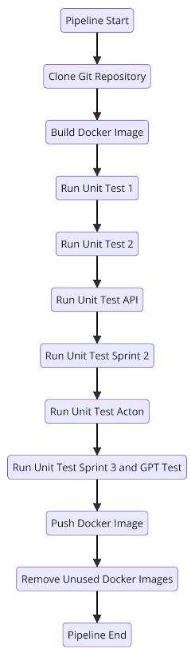

# AI_tool
Code Quality, Consistency, and Security with AI
*you need for this project, openAI APIKEY*

## development method
Performed using the Scrum Master method, while dividing into sprints, during development I consistently used Jira.

## Project Vision

AI_tool is an AI-powered web platform designed to usher in a new era of code quality, consistency, and security for software development teams.

## The Challenge

Development teams face increasing challenges in maintaining high code quality, ensuring consistency across projects, and safeguarding against security vulnerabilities.

## The Solution

AI_tool addresses these challenges head-on by leveraging cutting-edge artificial intelligence. The platform automates code quality checks, enforces coding standards, and identifies potential security risks, significantly reducing human error and vulnerabilities.

## Key Benefits

* Unparalleled Code Quality: AI_tool guarantees top-tier code quality by minimizing human errors and security vulnerabilities.
* Enhanced Consistency:  enforces consistent coding standards across projects, ensuring a unified codebase.
* Streamlined Development:  reduces the time and resources required for code reviews, boosting development efficiency.
* User-Friendly Experience:  empowers development teams of all skill levels to harness the power of AI without extensive technical expertise.

## Development environment tools
| Tool        | Description                                                                                                                                           | Project Usage                                                                                                                                           |
|-------------|-------------------------------------------------------------------------------------------------------------------------------------------------------|----------------------------------------------------------------------------------------------------------------------------------------------------------|
| Flask       | Flask is a lightweight and modular web application framework for Python. It allows for fast and flexible web application development.                  | Flask was used as the foundation for the server-side development of the application, including route management, user management, and database communication. |
| SQLAlchemy  | SQLAlchemy is an ORM (Object-Relational Mapping) for Python that allows working with databases as objects.                                             | SQLAlchemy was used for database management, including defining models, executing queries, and managing tables.                                          |
| Flask-Login | Flask-Login is an extension for Flask designed to manage user authentication and sessions.                                                            | It was used to handle login processes, user authentication, and maintaining user sessions.                                                               |
| Jinja2      | Jinja2 is a template engine for Python that enables dynamic generation of HTML pages.                                                                 | It was used to dynamically create HTML pages, including using templates for different pages in the system.                                                |
| OpenAI API  | OpenAI API provides access to AI models for various tasks such as text analysis, natural language understanding, and more.                            | OpenAI API was used to assess code quality, security, and consistency through AI models, providing feedback and ratings to developers.                   |
| Bootstrap   | Bootstrap is a framework for HTML, CSS, and JavaScript that allows for responsive and user-friendly web design.                                       | It was used for the UI design of the application, including layout arrangement, buttons, forms, and other components.                                     |
| SQLite      | SQLite is a lightweight database that does not require a separate server installation.                                                                | SQLite was used as the database for the application, storing user data, tasks, projects, and logs.                                                       |
| GitHub      | GitHub is a version control system that allows tracking changes in source code. GitHub is a cloud-based hosting service for Git projects.             | It was used for managing the project's code versions, and GitHub was used for hosting the project and collaborating with other developers.               |

## Testing: The Holy Trinity

### Role of Each Tool:

- **Git**: A version control system.
- **Jenkins**: An automation server. This tool allows you to define and run software build, test, and deployment processes automatically.
- **Docker**: A platform for creating and running applications within containers (a "virtual" environment).

### How It Works:

1. **Development and Code Changes**: Write code and push it to Git.
2. **Jenkins Detects Changes**: Jenkins is configured to monitor Git. Whenever there's a change in the code, Jenkins detects it and triggers an automated process.
3. **Build and Test**: Jenkins copies the code from Git, builds the software, and runs automated tests to ensure everything is working correctly. This execution happens within Docker to create an isolated build environment.

### The Final Jenkins Pipeline:

The pipeline executes a series of steps to build, test, and push a Docker image. The steps are:

1. **Clone Git**:
   - This step is responsible for cloning the Git repository defined in the URL to the main branch path. This step ensures that the latest code is available on the machine where the pipeline is running.

2. **Build Docker Image**:
   - Create a Docker image from the code fetched from Git.
   - A Docker image is a type of package that contains everything your application needs to run (including code, dependencies, and configuration).

3. **Unit Test 1**:
   - The built image is run within its Docker environment and executes the first test using `python -m unit_test`. Details about what exactly is tested in these tests are provided above.

4. **Unit Test 2**:
   - Similar to the previous step, but runs tests from the end of the first sprint named `uTest_End_sprint`. Details about what exactly is tested are provided above.

5. **Unit Test API**:
   - Another test runs within the built image, this time to test API keys.

6. **Unit Test Sprint 2**:
   - The `Sprint_2_unit_test` are unit tests designed to test software developed during Sprint 2.

7. **Unit Test Acton**:
   - In this step, the unit tests `Acton_Marketing_UniTest` are designed to test functionality related to marketing and everything done in Acton. More details are provided above.

8. **Unit Test Sprint 3 and GPT test**:
   - The `test_GPTIntegration` test combines tests related to Sprint 3 and GPT.

9. **Push Docker Image**:
   - After all tests pass successfully, the built image is pushed to Docker Hub. Here, it is pushed with tags of the current build ID and also `latest`, making it easy to identify and use.

10. **Remove Unused Docker Images**:
    - The final step takes care of deleting old, unused Docker images to free up space on the machine where the pipeline is running.




## Summary of Understanding Developed

### Deep Use of Flask:

- **Modular Architecture**: The application was structured into modules and components for efficient and maintainable code management.
- **Routing and Templates**: Routing was used to define URL paths, and Jinja2 templates were used to create dynamic user interfaces.
- **Handling Forms and Flash Messages**: Worked with HTML forms, validated input, and displayed informative messages to the user.
- **User Authentication and Role Management**: Implemented a flexible authorization system, defining different roles and access rights.
- **RESTful Design Principles**: Applied RESTful principles to create efficient and extensible APIs.
- **Routing and HTTP Methods**: Ensured a solid understanding of routing and HTTP methods for handling requests and responses.

### Flask-Login Integration:

- **User Authentication and Session Management**: Leveraged Flask-Login to manage user authentication and permissions, including registration, login, and logout.
- **Role-Based Access Control**: Defined different roles (e.g., user, admin) and limited access to resources based on the user's role.

### Database Interaction (SQLAlchemy):

- **ORM Utilization**: Used SQLAlchemy, a Python ORM, to simplify database interaction.
- **Model Definition and Queries**: Created models to represent database tables, and executed queries to add, update, delete, and retrieve data.

### Security:

- **Password Hashing**: Secured passwords using hashing to prevent exposure in the event of a breach.
- **Protection Against Common Attacks**: Implemented measures to protect against attacks such as SQL Injection and Cross-Site Scripting (XSS).
- **Adherence to Modern Security Principles**: Followed best practices to ensure user privacy and data protection.

### User Interface and Management Panel:

- **User-Friendly Interface**: Developed an intuitive and user-friendly interface for end-users.
- **Management Panel**: Created a management panel for system management by administrators.
- **Front-End Technologies**: Integrated front-end technologies such as HTML, CSS, and JavaScript.

### Features and External API Integration:

- **Advanced Functionality**: Added advanced features to the application, such as chat, notifications, and a rating system.
- **External API Integration**: Integrated the application with external APIs for authentication, maps, or payment services.


## Installation

**Prerequisites**

* Python
* pip (Python package installer)
* A modern web browser

**Steps**

1. **Clone the repository:**
   ```bash
   git clone 
   ```

2. **Navigate to the project directory:**
   ```bash
   cd project-w
   ```

3. **Create a virtual environment (recommended):**
   ```bash
   python3 -m venv venv
   # # On Mac\linux source venv/bin/activate  # On Windows, use `venv\Scripts\activate`
   ```

4. **Install dependencies from `requirements.txt`:**
   ```bash
   pip install -r requirements.txt
   ```

5. **Run the Flask development server:**
   ```bash
   flask run 
   # or 
   python app.py
   ```

6. **Open your browser and visit `http://127.0.0.1:5000`**
